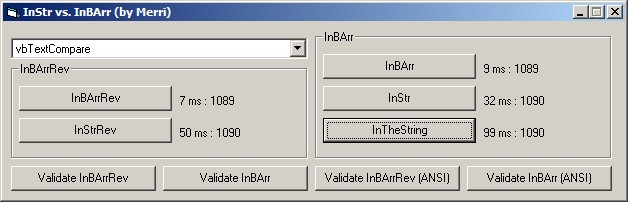

## InBArr \- now supports Unicode\!

### Description

These functions perform a search like InStr within a byte array. Accessing byte arrays is much faster than accessing strings, but there aren't many tools provided in VB to handle the arrays. So here you have something: InBArr and InBArrRev, which can search byte arrays with a string keyword in both Unicode and ANSI modes. *** NOTE: you probably don't have a file named C:\hotfix.txt, so you have to edit Form_Load so you can try it. *** Votes welcome :)
 
### More Info
 

             |
---                |---
**Submitted On**   |2005-06-24 09:11:38
**By**             |[Vesa Piittinen](https://github.com/Planet-Source-Code/PSCIndex/blob/master/ByAuthor/vesa-piittinen.md)
**Level**          |Advanced
**User Rating**    |5.0 (25 globes from 5 users)
**Compatibility**  |VB 6\.0
**Category**       |[String Manipulation](https://github.com/Planet-Source-Code/PSCIndex/blob/master/ByCategory/string-manipulation__1-5.md)
**World**          |[Visual Basic](https://github.com/Planet-Source-Code/PSCIndex/blob/master/ByWorld/visual-basic.md)
**Archive File**   |[InBArr\_\-\_n191069782005\.zip](https://github.com/Planet-Source-Code/vesa-piittinen-inbarr-now-supports-unicode__1-61591/archive/master.zip)

